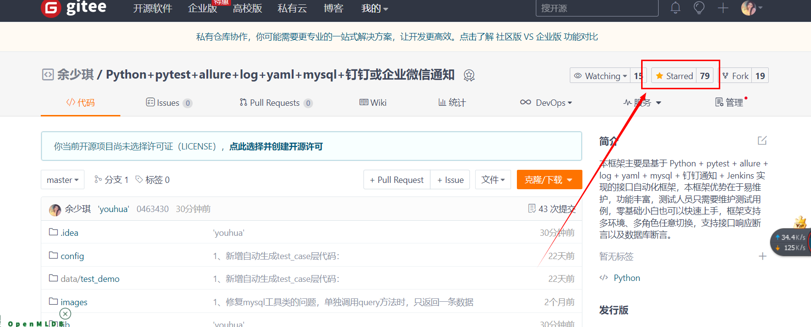
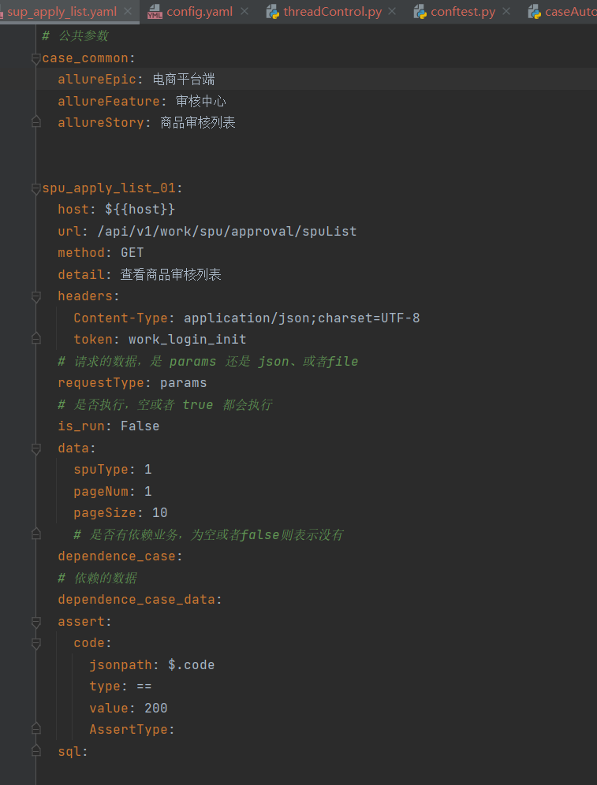
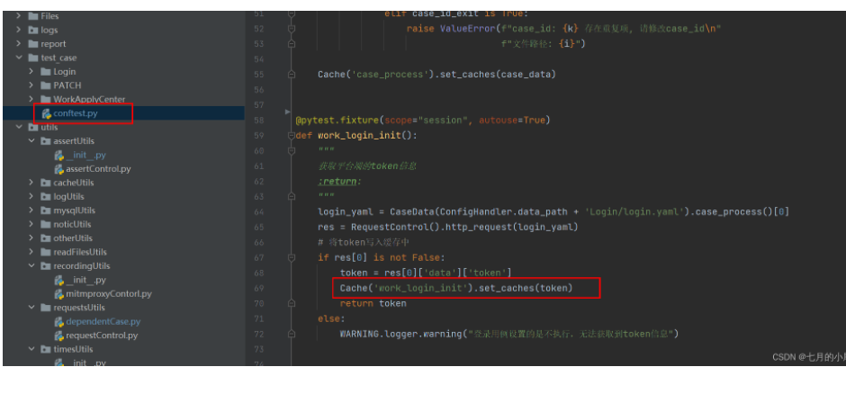
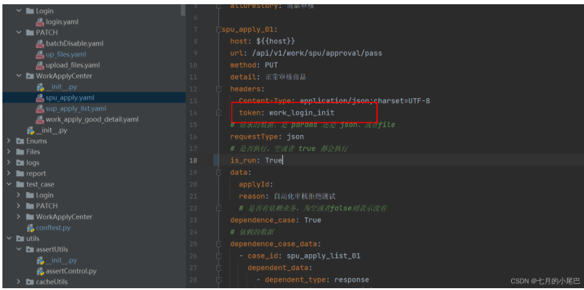
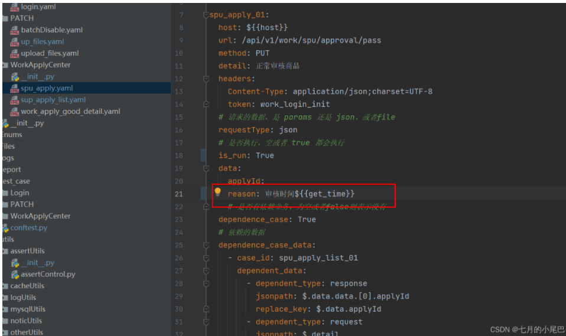
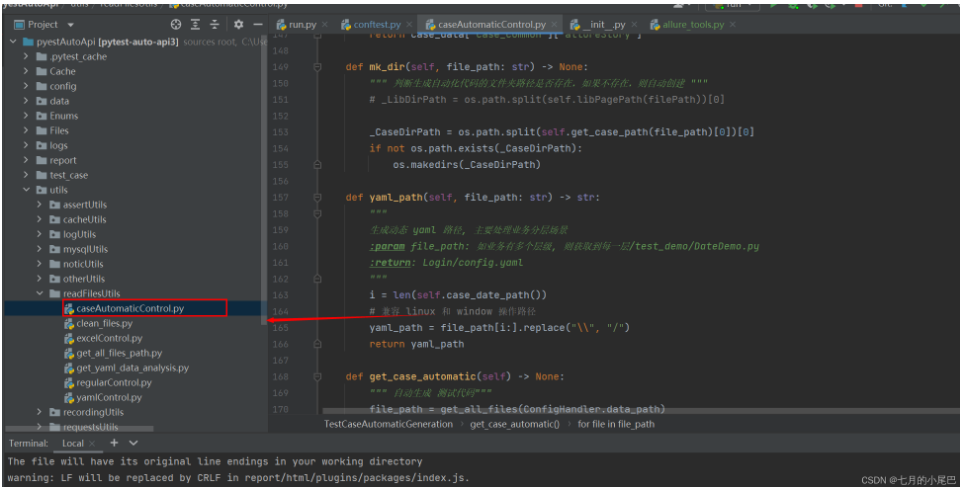
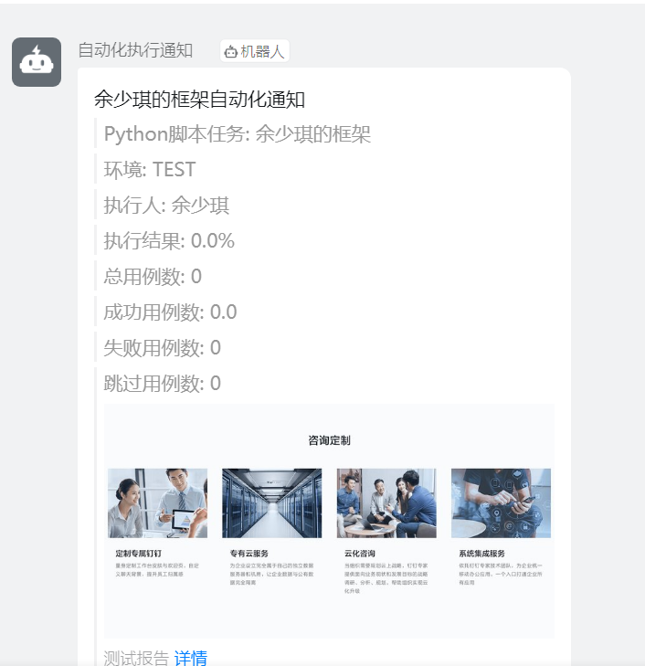
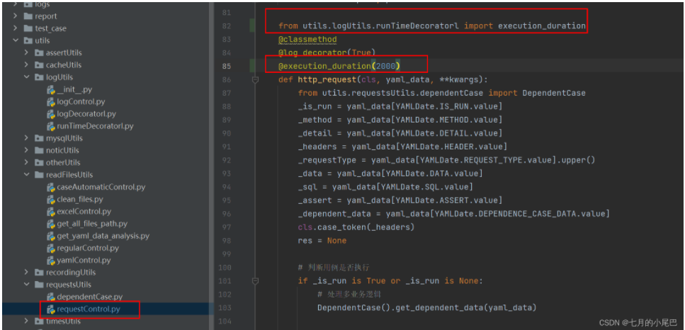

## 框架介绍

本框架主要是基于 Python + pytest + allure + log + yaml + mysql + redis + 钉钉通知 + Jenkins 实现的接口自动化框架。

* git地址: [https://gitee.com/yu_xiao_qi/pytest-auto-api](https://gitee.com/yu_xiao_qi/pytest-auto-api)
* 项目参与者: 余少琪
* 技术支持邮箱: 1603453211@qq.com
* 个人博客地址:  [https://blog.csdn.net/weixin_43865008](https://blog.csdn.net/weixin_43865008)

如果对您有帮助，请点亮 小星星 以表支持，谢谢

## 前言

公司突然要求你做自动化，但是没有代码基础不知道怎么做？或者有自动化基础，但是不知道如何系统性的做自动化，
放在yaml文件中维护，不知道如何处理多业务依赖的逻辑？

那么这里 Gitte 中开源的自动化框架，将为你解决这些问题。
框架主要使用 python 语言编写，结合 pytest 进行二次开发，用户仅需要在 yaml 文件中编写测试用例，
编写成功之后，会自动生成 pytest 的代码，零基础代码小白，也可以操作。

本框架支持多业务接口依赖，多进程执行，mysql 数据库断言和 接口响应断言，并且用例直接在yaml文件中维护，无需编写业务代码，
接口pytest框架生成allure报告，并且发送 企业微信通知/ 钉钉通知/ 邮箱通知/ 飞书通知，灵活配置。

## 实现功能

* 测试数据隔离, 实现数据驱动
* 支持多接口数据依赖: 如A接口需要同时依赖B、C接口的响应数据作为参数
* 数据库断言: 直接在测试用例中写入查询的sql即可断言，无需编写代码
* 动态多断言: 如接口需要同事校验响应数据和sql校验，支持多场景断言
* 自动生成用例代码: 测试人员在yaml文件中填写好测试用例, 程序可以直接生成用例代码，纯小白也能使用
* 统计接口的运行时长: 拓展功能，订制开关，可以决定是否需要使用
* 日志模块: 打印每个接口的日志信息，同样订制了开关，可以决定是否需要打印日志
* 钉钉、企业微信通知: 支持多种通知场景，执行成功之后，可选择发送钉钉、或者企业微信、邮箱通知
* 自定义拓展字段: 如用例中需要生成的随机数据，可直接调用
* 多线程执行

## 联系方式

因为微信群二维码，有效期只有15天，如果有遇到的问题的同学，可以先加微信：being_chaoren

加微信的朋友，需备注是从Gitte上看到的加的好友，加上之后，会将你们拉入一个自动化测试微信交流群

## 目录结构

    ├── Cache                          // 存放缓存文件
    ├── config                         // 配置
    │   ├── conf.yaml                  // 公共配置
    │   ├── setting.py                 // 环境路径存放区域
    ├── data                           // 测试用例数据
    ├── Enums                          // 枚举层，用于存放项目中所需的枚举
    ├── File                           // 上传文件接口所需的文件存放区域
    ├── log                            // 日志层
    ├── report                         // 测试报告层
    ├── test_case                      // 测试用例代码
    ├── utils                          // 工具类
    │   └── assertUtils                // 断言
    │       └── assertUtils .py        
    │   └── cacheUtils                 // 缓存处理模块
    │       └── cacheControl.py
    │       └── redisControl.py  
    │   └── logUtils                   // 日志处理模块
    │       └── logControl.py
    │       └── logDecoratrol.py       // 日志装饰器
    │       └── runTimeDecoratrol.py   // 统计用例执行时长装饰器
    │   └── mysqlUtils                 // 数据库模块
    │       └── get_sql_data.py       
    │       └── mysqlControl.py   
    │   └── noticUtils                 // 通知模块
    │       └── dingtalkControl.py     // 钉钉通知 
    │       └── feishuControl.py       // 飞书通知
    │       └── sendmailControl.py     // 邮箱通知
    │       └── weChatSendControl.py   // 企业微信通知
    │   └── otherUtils                 // 其他工具类
    │       └── allureDate             // allure封装
    │           └── allure_report_data.py // allure报告数据清洗
    │           └── allure_tools..py   // allure 方法封装
    │       └── localIpControl.py      // 获取本地IP
    │       └── threadControl.py       // 定时器类
    │   └── readFilesUtils             // 文件操作
    │       └── caseAutomaticControl.py // 自动生成测试代码 
    │       └── clean_files.py          // 清理文件
    │       └── excelControl.py         // 读写excel
    │       └── get_all_files_path.py   // 获取所有文件路径
    │       └── get_yaml_data_analysis.py // yaml用例数据清洗
    │       └── regularControl.py        // 正则
    │       └── yamlControl.py          // yaml文件读写
    │   └── recordingUtils             // 代理录制
    │       └── mitmproxyContorl..py
    │   └── requestsUtils 
    │       └── dependentCase.py        // 数据依赖处理
    │       └── requestControl..py      // 请求封装
    │   └── timeUtils
    ├── Readme.md                       // help
    ├── pytest.ini                  
    ├── run.py                           // 运行入口  
    

## 依赖库

    allure-pytest==2.9.45
    allure-python-commons==2.9.45
    atomicwrites==1.4.0
    attrs==21.2.0
    certifi==2021.10.8
    cffi==1.15.0
    charset-normalizer==2.0.7
    colorama==0.4.4
    colorlog==6.6.0
    cryptography==36.0.0
    DingtalkChatbot==1.5.3
    execnet==1.9.0
    Faker==9.8.3
    idna==3.3
    iniconfig==1.1.1
    jsonpath==0.82
    packaging==21.3
    pluggy==1.0.0
    py==1.11.0
    pycparser==2.21
    PyMySQL==1.0.2
    pyOpenSSL==21.0.0
    pyparsing==3.0.6
    pytest==6.2.5
    pytest-forked==1.3.0
    pytest-xdist==2.4.0
    python-dateutil==2.8.2
    PyYAML==6.0
    requests==2.26.0
    six==1.16.0
    text-unidecode==1.3
    toml==0.10.2
    urllib3==1.26.7
    xlrd==2.0.1
    xlutils==2.0.0
    xlwt==1.3.0

## 安装教程

输入如下命令，安装本框架的所有第三方库依赖

    pip install -r requirements.txt

## 用例中相关字段的介绍

上方截图，就是一个用例中需要维护的相关字段，下面我会对每个字段的作用，做出解释。

## 如何发送get请求
上方了解了用例的数据结构之后，下面我们开始编写第一个get请求方式的接口。
首先，开始编写项目之后，我们在 conf.yaml 中配置项目的域名

域名配置好之后，我们来编写测试用例，在 data 文件下面，创建一个名称为
spu_apply_list.yaml 的用例文件，内容如下

    # 公共参数
    case_common:
      allureEpic: 电商平台端
      allureFeature: 审核中心
      allureStory: 商品审核列表
    
    
    spu_apply_list_01:
      host: ${{host}}
      url: /api/v1/work/spu/approval/spuList
      method: GET
      detail: 查看商品审核列表
      headers:
        Content-Type: application/json;charset=UTF-8
        token: work_login_init
      # 请求的数据，是 params 还是 json、或者file
      requestType: params
      # 是否执行，空或者 true 都会执行
      is_run: False
      data:
        spuType: 1
        pageNum: 1
        pageSize: 10
        # 是否有依赖业务，为空或者false则表示没有
      dependence_case:
      # 依赖的数据
      dependence_case_data:
      assert:
        code:
          jsonpath: $.code
          type: ==
          value: 200
          AssertType:
      sql:

get请求我们 requestType 写的是params，这样发送请求时，我们会将请求参数拼接中url中，最终像服务端发送请求的地址格式会为：

    ${{host}}/api/v1/work/spu/approval/spuList?supType=1&pageNum=1&pageSize=10

## 如何发送post请求

    # 公共参数
    case_common:
      allureEpic: 盲盒APP
      allureFeature: 登录模块
      allureStory: 获取登录验证码
    
    send_sms_code_01:
        host: ${{host}}
        url: /mobile/sendSmsCode
        method: POST
        detail: 正常获取登录验证码
        headers:
          appId: '23132'
          masterAppId: masterAppId
          Content-Type: application/json;charset=UTF-8
        # 请求的数据，是 params 还是 json、或者file
        requestType: json
        # 是否执行，空或者 true 都会执行
        is_run:
        data:
          phoneNumber: "180xxxx9278"
          # 是否有依赖业务，为空或者false则表示没有
        dependence_case: False
            # 依赖的数据
        dependence_case_data:
        assert:
          code:
            jsonpath: $.code
            type: ==
            value: '00000'
            AssertType:
          success:
            jsonpath: $.success
            type: ==
            value: true
            AssertType:
    
        sql:
        
这里post请求，我们需要请求的数据格式是json格式的，那么requestType 则填写为json格式。包括 PUT/DELETE/HEAD 请求的数据格式都是一样的，唯一不同的就是需要配置 reuqestType，如果需要请求的参数是json格式，则requestType我们就填写json，如果是url拼接的形式，我们就填写 params

## 如何测试上传文件接口

首先，我们将所有需要测试的文件，全部都放在 files 文件夹中

    requestType: file
    # 是否执行，空或者 true 都会执行
    is_run:
    data:
      file: 
         # file 直接写文件名称
         files:排入水体名.png

      # 是否有依赖业务，为空或者false则表示没有
    dependence_case: False

在yaml文件中，我们需要注意两个地方，主要是用例中的requestType、和 filename 字段：
1、requestType: 上传文件，我们需要更改成 file
2、filename 参数名称: 上传文件，我们只需要填写files文件夹下的文件名称即可，程序在发送请求时，会去识别文件

## 多业务逻辑，如何编写测试用例

多业务这一块，我们拿个简单的例子举例，比如登录场景，在登陆之前，我们需要先获取到验证码。

首先，我们先创建一个 get_send_sms_code.yaml 的文件，编写一条发送验证码的用例

    # 公共参数
    case_common:
      allureEpic: 盲盒APP
      allureFeature: 登录模块
      allureStory: 获取登录验证码
    
    send_sms_code_01:
        host: ${{host}}
        url: /mobile/sendSmsCode
        method: POST
        detail: 正常获取登录验证码
        headers:
          appId: '23132'
          masterAppId: masterAppId
          Content-Type: application/json;charset=UTF-8
        # 请求的数据，是 params 还是 json、或者file
        requestType: json
        # 是否执行，空或者 true 都会执行
        is_run:
        data:
          phoneNumber: "180****9278"
          # 是否有依赖业务，为空或者false则表示没有
        dependence_case: False
            # 依赖的数据
        dependence_case_data:
        assert:
          code:
            jsonpath: $.code
            type: ==
            value: '00000'
            AssertType:
          success:
            jsonpath: $.success
            type: ==
            value: true
            AssertType:
    
        sql:

编写好之后，我们在创建一个 login.yaml 文件

    # 公共参数
    case_common:
      allureEpic: 盲盒APP
      allureFeature: 登录模块
      allureStory: 登录
    
    login_02:
        host: ${{host}}
        url: /login/phone
        method: POST
        detail: 登录输入错误的验证码
        headers:
          appId: '23132'
          masterAppId: masterAppId
          Content-Type: application/json;charset=UTF-8
        # 请求的数据，是 params 还是 json、或者file
        requestType: json
        # 是否执行，空或者 true 都会执行
        is_run:
        data:
          phoneNumber: 18014909278
          code:
          # 是否有依赖业务，为空或者false则表示没有
        dependence_case: True
            # 依赖的数据
        dependence_case_data:
          - case_id: send_sms_code_02
            dependent_data:
              - dependent_type: response
                jsonpath: $.code
                replace_key: $.data.code
    
        assert:
          code:
            jsonpath: $.code
            type: ==
            value: '00000'
            AssertType:
        sql:

其中处理多业务的核心区域，主要在这里:

       dependence_case: True
            # 依赖的数据
        dependence_case_data:
          - case_id: send_sms_code_02
            dependent_data:
              - dependent_type: response
                jsonpath: $.code
                replace_key: $.data.code

首先，我们 dependence_case 需要设置成 True，并且在下面的 dependence_case_data 中设计相关依赖的数据。

1、case_id：上方场景中，我们登录需要先获取验证码，因此依赖的case_id 就是发送短信验证码的 case_id ：send_sms_code_02
2、dependent_type：我们依赖的是获取短信验证码接口中的响应内容，因此这次填写的是 response
3、jsonpath: 通过jsonpath 提取方式，提取到短信验证码中的验证码内容
4、replace_key：拿到验证码之后，我们将本条用例中的data中的code参数，那么我们使用jsonpath的方式，进行替换 $.data.code

## 多业务逻辑，需要依赖同一个接口中的多个数据

    dependence_case_data:
      - case_id: send_sms_code_02
        dependent_data:
          # 提取接口响应的code码
          - dependent_type: response
            jsonpath: $.code
            replace_key: $.data.code
          # 提取接口响应的accessToken
          - dependent_type: response
            jsonpath: $.data.accessToken
            # 替换请求头中的accessToken
            replace_key: $.headers.accessToken    

如上方示例，可以添加多个 dependent_type

## 多业务逻辑，需要依赖不同接口的数据

假设我们需要获取 send_sms_code_01、get_code_01两个接口中的数据，用例格式如下
    
    dependence_case: True
        # 依赖的数据
    dependence_case_data:
      - case_id: send_sms_code_01
        dependent_data:
          # 提取接口响应的code码
          - dependent_type: response
            jsonpath: $.code
            replace_key: $.data.code
      - case_id: get_code_01
        dependent_data:
          # 提取接口响应的code码
          - dependent_type: response
            jsonpath: $.code
            replace_key: $.data.code            

## 用例中需要依赖登录的token，如何设计

首先，为了防止重复请求调用登录接口，pytest中的 conftest.py 提供了热加载机制，看上方截图中的代码，我们需要在 conftest.py 提前编写好登录的代码。

如上方代码所示，我们会先去读取login.yaml文件中的用例，然后执行获取到响应中的token，然后 编写 Cache('work_login_init').set_caches(token)，将token写入缓存中，其中 work_login_init 是缓存名称。

编写好之后，我们会在 requestControl.py 文件中，读取缓存中的token，如果该条用例需要依赖token，则直接进行内容替换。

这里在编写用例的时候，token 填写我们所编写的缓存名称即可。

## 用例中如何生成随机数据

比如我们有些特殊的场景，可能会涉及到一些定制化的数据，每次执行数据，需要按照指定规则随机生成。

如上图所示，我们用例中的 reason 审核原因后方，需要展示审核的当前时间。那么我们首先需要封装一个获取当前时间的方法

那么我们就在 regularControl.py 文件中，编写 get_time 的方法。编写好之后，在用例中编写规则如下：

    reason: 审核时间${{get_time}}
使用 ${{函数名称}}的方法，程序调用时，会生成当前时间。在regularControl.py 文件中，我还封装了一些常用的随机数，如随机生成男生姓名、女生姓名、身份证、邮箱、手机号码之类的，方便大家使用。 如，随机生成邮箱，我们在用例中编写的格式为 ${{get_email}} 。

其他所需随机生成的数据，可在文件中自行添加。

## 用例中如何进行接口断言和数据库断言

假设现在我需要测试一个报表统计的数据，该接口返回了任务的处理时长 和 处理数量。功能如下截图所示：

假设下方是我们拿到接口响应的数据内容：

    {"code": 200, "times": 155.91, "counts": 9}

这个时候，我们需要判断该接口返回的数据是否正确，就需要编写sql，对响应内容进行校验。

因此我们编写了如上sql，查出对应的数据，那么用例中编写规则如下，下方我们分别断言了两个内容，一个是对接口的响应code码进行断言，一个是断言数据库中的数据。

      assert:
        code:
          jsonpath: $.code
          type: ==
          value: 200
          # 断言接口响应时，可以为空
          AssertType:
       do_time:
         # jsonpath 拿到接口响应的数据
          jsonpath: $.times
          type: ==
          # sql 查出来的数据，是字典类型的，因此这里是从字段中提取查看出来的字段
          value: $.do_time
          # 断言sql的时候，AssertType 的值需要填写成 SQL
          AssertType: SQL
       question_counts:
          jsonpath: $.counts
          type: ==
          # 
          value: $.question_counts
          # 断言sql的时候，AssertType 的值需要填写成 SQL
          AssertType: SQL 
      sql:
        - select * from test_goods where shop_id = 515

我们分别对用例的数据进行讲解，首先是响应断言, 编写规则如下

    code:
      # 通过jsonpath获取接口响应中的code {"code": 200, "times": 155.91, "counts": 9}
      jsonpath: $.code
      type: ==
      value: 200
      # 断言接口响应时，可以为空
      AssertType:

下面是对sql进行断言

       question_counts:
          # 断言接口响应的问题上报数量counts {"code": 200, "times": 155.91, "counts": 9}
          jsonpath: $.counts
          type: ==
          # 查询sql，我们数据库查到的数据是一个字段，数据是这样的：{question_counts: 13, do_time: 1482.70}, 这里我们通过 jsonpath获取question_counts
          value: $.question_counts
          # 断言sql的时候，AssertType 的值需要填写成 SQL
          AssertType: SQL 
      sql:
        - SELECT round( sum(( UNIX_TIMESTAMP( filing_time )- UNIX_TIMESTAMP( report_time )) / 60 ) / 60, 2 ) AS do_time, count( id ) AS question_counts FROM fl_report_info WHERE state IN ( 1, 3 )

有些细心的小伙伴会发现，我们的sql，是列表类型的。这样就意味这，我们的sql可以同时编写多条，这样会对不会编写多表联查的小伙伴比较友好，可以进行单表查询，获取我们需要的数据。

    sql:
      - select * from users;
      - select * from goods;

## 自动生成test_case层代码

小伙伴们在编写好 yaml 用例之后，可以直接执行 caseAutomaticControl.py ，会跟你设计的测试用例，生成对应的代码。

## 发送钉钉通知通知

## 发送企业微信通知

## 日志打印装饰器

在requestControl.py中，我单独封装了一个日志装饰器，需要的小伙伴可以不用改动代码，直接使用，如果不需要，直接注释，或者改成False。控制台将不会有日志输出

## 统计用例运行时长

同样，这里封装了一个统计用例运行时长的装饰器，使用改装饰器前，需要先进行导包

    from utils.logUtils.runTimeDecoratorl import execution_duration
导入之后，调用改装饰器，装饰器中填写的用例执行时长，以毫秒为单位，如这里设置的2000ms，那么如果该用例执行大于2000ms，则会输出一条告警日志。

    @execution_duration(2000)

## 生成allure报告

我们直接运行主程序 run.py ，运行完成之后，就可以生成漂亮的allure报告啦~

## 其他

本框架为2.0升级版本，升级之后的功能，现在基本上都是在yaml中维护用例，无需测试人员编写代码，
和 1.0版本的区别在于，1.0版本还需要测试人员手动编写多业务逻辑的代码，需要有一定基础编码的能力

但是1.0版本，同样也可以自动生成代码，yaml中维护数据，对相对简单，如果偏于yaml简单维护的同学，可以切换查看1.0分支
下方是1.0分支的操作文档：[点我查看](https://blog.csdn.net/weixin_43865008/article/details/121903028?spm=1001.2014.3001.5502)

*******************************************************

以上便是整个框架的使用说明，这个框架属于个人业余时间开发，大家如果在使用中遇到什么问题，或者有相关建议，可以随时反馈给我，
_框架内容会随着大家的反馈，持续更新！邮箱地址：1602343211@qq.com

如果觉得框架有帮助到你，麻烦收藏一下哦~~谢谢。:)