## 框架介绍

本框架主要是基于 Python + pytest + allure + log + yaml + mysql + redis + 钉钉通知 + Jenkins 实现的接口自动化框架。

* git地址: [https://gitee.com/yu_xiao_qi/pytest-auto-api2](https://gitee.com/yu_xiao_qi/pytest-auto-api2)
* 项目参与者: 余少琪
* 技术支持邮箱: 1603453211@qq.com
* 个人博客地址:  [https://blog.csdn.net/weixin_43865008](https://blog.csdn.net/weixin_43865008)

如果对您有帮助，请点亮 小星星 以表支持，谢谢

## 前言

公司突然要求你做自动化，但是没有代码基础不知道怎么做？或者有自动化基础，但是不知道如何系统性的做自动化，
放在yaml文件中维护，不知道如何处理多业务依赖的逻辑？

那么这里 Gitte 中开源的自动化框架，将为你解决这些问题。
框架主要使用 python 语言编写，结合 pytest 进行二次开发，用户仅需要在 yaml 文件中编写测试用例，
编写成功之后，会自动生成 pytest 的代码，零基础代码小白，也可以操作。

本框架支持多业务接口依赖，多进程执行，mysql 数据库断言和 接口响应断言，并且用例直接在yaml文件中维护，无需编写业务代码，
接口pytest框架生成allure报告，并且发送 企业微信通知/ 钉钉通知/ 邮箱通知/ 飞书通知，灵活配置。

## 实现功能

* 测试数据隔离, 实现数据驱动
* 支持多接口数据依赖: 如A接口需要同时依赖B、C接口的响应数据作为参数
* 数据库断言: 直接在测试用例中写入查询的sql即可断言，无需编写代码
* 动态多断言: 如接口需要同时校验响应数据和sql校验，支持多场景断言
* 自动生成用例代码: 测试人员在yaml文件中填写好测试用例, 程序可以直接生成用例代码，纯小白也能使用
* 代理录制: 支持代理录制，生成yaml格式的测试用例  
* 统计接口的运行时长: 拓展功能，订制开关，可以决定是否需要使用
* 日志模块: 打印每个接口的日志信息，同样订制了开关，可以决定是否需要打印日志
* 钉钉、企业微信通知: 支持多种通知场景，执行成功之后，可选择发送钉钉、或者企业微信、邮箱通知
* 自定义拓展字段: 如用例中需要生成的随机数据，可直接调用
* 多线程执行
* 支持swagger接口文档转成yaml用例，节省用例编写时间

## 遇到问题

* 请仔细阅读文档，文档中几乎可以帮你避免所有的问题
* 可以添加微信： being_chaoren, 添加微信会将你拉倒自动化交流群中，群内有很多热心的小伙伴，但是前提是希望你已经阅读了文档中的所有内容
* 你也可以请作者为你解答，当然我不是免费的

## 目录结构

    ├── common                         // 配置
    │   ├── conf.yaml                  // 公共配置
    │   ├── setting.py                 // 环境路径存放区域
    ├── data                           // 测试用例数据
    ├── File                           // 上传文件接口所需的文件存放区域
    ├── logs                           // 日志层
    ├── report                         // 测试报告层
    ├── test_case                      // 测试用例代码
    ├── utils                          // 工具类
    │   └── assertion                
    │       └── assert_control.py      // 断言
    │       └── assert_type.py         // 断言类型
    │   └── cache_process              // 缓存处理模块
    │       └── cacheControl.py
    │       └── redisControl.py  
    │   └── logUtils                   // 日志处理模块
    │       └── logControl.py
    │       └── logDecoratrol.py       // 日志装饰器
    │       └── runTimeDecoratrol.py   // 统计用例执行时长装饰器
    │   └── mysqlUtils                 // 数据库模块
    │       └── get_sql_data.py       
    │       └── mysqlControl.py   
    │   └── noticUtils                 // 通知模块
    │       └── dingtalkControl.py     // 钉钉通知 
    │       └── feishuControl.py       // 飞书通知
    │       └── sendmailControl.py     // 邮箱通知
    │       └── weChatSendControl.py   // 企业微信通知
    │   └── otherUtils                 // 其他工具类
    │       └── allureDate             // allure封装
    │           └── allure_report_data.py // allure报告数据清洗
    │           └── allure_tools.py   // allure 方法封装
    │           └── error_case_excel.py   // 收集allure异常用例，生成excel测试报告
    │       └── localIpControl.py      // 获取本地IP
    │       └── threadControl.py       // 定时器类
    │   └── readFilesUtils             // 文件操作
    │       └── caseAutomaticControl.py // 自动生成测试代码 
    │       └── clean_files.py          // 清理文件
    │       └── excelControl.py         // 读写excel
    │       └── get_all_files_path.py   // 获取所有文件路径
    │       └── get_yaml_data_analysis.py // yaml用例数据清洗
    │       └── regularControl.py        // 正则
    │       └── yamlControl.py          // yaml文件读写
    │   └── recordingUtils             // 代理录制
    │       └── mitmproxyContorl.py
    │   └── requestsUtils 
    │       └── dependentCase.py        // 数据依赖处理
    │       └── requestControl.py      // 请求封装
    │   └── timeUtils
    ├── Readme.md                       // help
    ├── pytest.ini                  
    ├── run.py                           // 运行入口  
    

## 依赖库

    allure-pytest==2.9.45
    allure-python-commons==2.9.45
    atomicwrites==1.4.0
    attrs==21.2.0
    certifi==2021.10.8
    cffi==1.15.0
    charset-normalizer==2.0.7
    colorama==0.4.4
    colorlog==6.6.0
    cryptography==36.0.0
    DingtalkChatbot==1.5.3
    execnet==1.9.0
    Faker==9.8.3
    idna==3.3
    iniconfig==1.1.1
    jsonpath==0.82
    packaging==21.3
    pluggy==1.0.0
    py==1.11.0
    pycparser==2.21
    PyMySQL==1.0.2
    pyOpenSSL==21.0.0
    pyparsing==3.0.6
    pytest==6.2.5
    pytest-forked==1.3.0
    pytest-xdist==2.4.0
    python-dateutil==2.8.2
    PyYAML==6.0
    requests==2.26.0
    six==1.16.0
    text-unidecode==1.3
    toml==0.10.2
    urllib3==1.26.7
    xlrd==2.0.1
    xlutils==2.0.0
    xlwt==1.3.0

## 安装教程

首先，执行本框架之后，需要搭建好 python、jdk、 allure环境

搭建python教程：[http://c.biancheng.net/view/4161.html](http://c.biancheng.net/view/4161.html)

搭建jdk环境：[https://www.cnblogs.com/zll-wyf/p/15095664.html](https://www.cnblogs.com/zll-wyf/p/15095664.html)

安装allure：[https://blog.csdn.net/m0_49225959/article/details/117194318](https://blog.csdn.net/m0_49225959/article/details/117194318)

如上环境如都搭建好，则安装本框架的所有第三方库依赖，执行如下命令

    pip3 install -r requirements.txt

如果在安装过程中出现如下 Could not find a version 类似的异常， 不用担心，可能是因为你安装的python环境
版本和我不一致导致的，直接 pip install 库名称，不指定版本安装就可以了。

如上方截图说没有找到 asgiref==3.5.1,报错的意思是，没有找到3.5.1这个版本，那么直接控制台输入 pip3 install asgiref 进行安装即可

## 接口文档

这里非常感谢一位安卓的朋友，给我推荐了开源的接口文件，框架中会针对开源接口中的登录、个人信息、收藏（新增、查看、修改、删除）等功能，编写结果自动化案例
下方是接口文档地址，大家可以自行查看（因为开源的接口，里面有些逻辑性的功能，如修改被删除的网址接口并没有过多的做判断，
因此用例中只写了一些基础的场景，仅供大家参考。）
[https://wanandroid.com/blog/show/2](https://wanandroid.com/blog/show/2)

## 如何创建用例

### 创建用例步骤
1、在data文件夹下方创建相关的yaml用例

2、写完之后，需要执行 utils\readFilesUtils\caseAutomaticControl.py 这个文件，生成自动化代码

3、执行caseAutomaticControl.py文件之后，会发现，在test_case层新增该条用例的对应代码，可直接执行该用例调试

4、注意，如果生成对应的测试代码之后，期间有更改过yaml用例中的内容，需要重新生成代码，必现因为更改yaml用例之后导致运行失败

5、当所有接口都编写好之后，可以直接运行run.py主程序，执行所有自动化接口

下面我们来看一下，如何创建用例

### 用例中相关字段的介绍

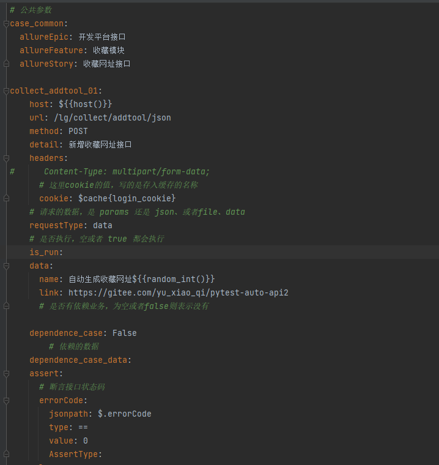

上方截图，就是一个用例中需要维护的相关字段，下面我会对每个字段的作用，做出解释。

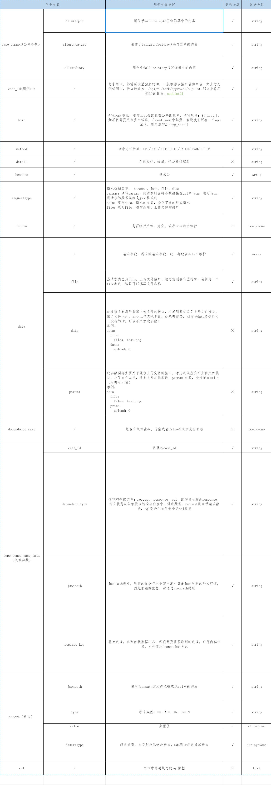

### 如何发送get请求
上方了解了用例的数据结构之后，下面我们开始编写第一个get请求方式的接口。
首先，开始编写项目之后，我们在 conf.yaml 中配置项目的域名

域名配置好之后，我们来编写测试用例，在 data 文件下面，创建一个名称为
collect_tool_list.yaml 的用例文件，请求/lg/collect/usertools/json这个收藏网址列表接口，所有接口的详细信息，可以在接口文档中查看，下方不在做赘述

接口文档：[https://wanandroid.com/blog/show/2](https://wanandroid.com/blog/show/2)

    # 公共参数
    case_common:
      allureEpic: 开发平台接口
      allureFeature: 收藏模块
      allureStory: 收藏网址列表接口
    
    collect_tool_list_01:
        host: ${{host()}}
        url: /lg/collect/usertools/json
        method: GET
        detail: 查看收藏网址列表接口
        headers:
          Content-Type: multipart/form-data;
          # 这里cookie的值，写的是存入缓存的名称
          cookie: login_cookie
        # 请求的数据，是 params 还是 json、或者file、data
        requestType: data
        # 是否执行，空或者 true 都会执行
        is_run:
        data:
          pageNum: 1
          pageSize: 10
        # 是否有依赖业务，为空或者false则表示没有
        dependence_case: False
            # 依赖的数据
        dependence_case_data:
        assert:
          # 断言接口状态码
          errorCode:
            jsonpath: $.errorCode
            type: ==
            value: 0
            AssertType:
        sql:

get请求我们 requestType 写的是 params ，这样发送请求时，我们会将请求参数拼接中url中，最终像服务端发送请求的地址格式会为：

    如: ${{host()}}/lg/collect/usertools/json?pageNum=1&pageSize=10

### 如何发送post请求

    # 公共参数
    case_common:
      allureEpic: 开发平台接口
      allureFeature: 收藏模块
      allureStory: 收藏网址接口
    
    collect_addtool_01:
        host: ${{host()}}
        url: /lg/collect/addtool/json
        method: POST
        detail: 新增收藏网址接口
        headers:
          Content-Type: multipart/form-data;
          # 这里cookie的值，写的是存入缓存的名称
          cookie: login_cookie
        # 请求的数据，是 params 还是 json、或者file、data
        requestType: data
        # 是否执行，空或者 true 都会执行
        is_run:
        data:
          name: 自动化生成收藏网址${{random_int()}}
          link: https://gitee.com/yu_xiao_qi/pytest-auto-api2
        # 是否有依赖业务，为空或者false则表示没有
        dependence_case: False
            # 依赖的数据
        dependence_case_data:
        assert:
          # 断言接口状态码
          errorCode:
            jsonpath: $.errorCode
            type: ==
            value: 0
            AssertType:
        sql:
            
这里post请求，我们需要请求的数据格式是json格式的，那么requestType 则填写为json格式。
包括 PUT/DELETE/HEAD 请求的数据格式都是一样的，唯一不同的就是需要配置 reuqestType，
如果需要请求的参数是json格式，则requestType我们就填写json，如果是url拼接的形式，我们就填写 params

### 如何测试上传文件接口

首先，我们将所有需要测试的文件，全部都放在 files 文件夹中
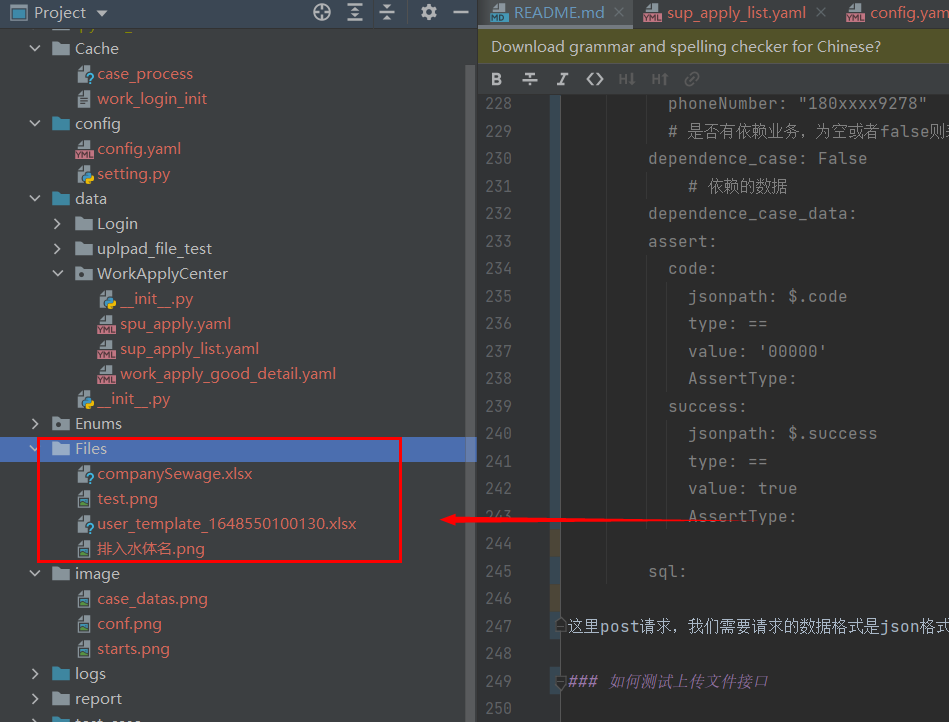

    requestType: file
    # 是否执行，空或者 true 都会执行
    is_run:
    data:
      file:
         xxx: 排入水体名.png

在yaml文件中，我们需要注意两个地方，主要是用例中的requestType、和 filename 字段：

* requestType: 上传文件，我们需要更改成 file
* file: 上传文件中，新增一个file关键字，在下方传我们需要的数据
* file_name: 首先，这个xxx是我们公司接口定义的上传文件的参数，排入水体名.png 这个是我们放在Files这个文件夹下方的文件名称
程序在执行的时候，会判断如果你的requestType为 file的时候，则会去执行file下方的参数，然后取到文件名称直接去执行用例

### 上传文件接口，即需要上传文件，又需要上传其他参数
    requestType: file
    # 是否执行，空或者 true 都会执行
    is_run:
    data:
      file:
         file_name: 排入水体名.png
      data:
         is_upload: 0
      params:
         collect: false

上方的这个案例，请求参数即上传了文件，又上传了其他参数

* 1、file： 这里下方上传的是文件参数
* 2、data： 这个data下方是该接口，除了文件参数，还需要上传其他的参数，这个参数会以json的方式传给服务端（如果没有其他参数，可以不用写这个）
* 3、params： 这个是除了文件参数以外的，上传的其他参数，这个参数是拼接在url后方的

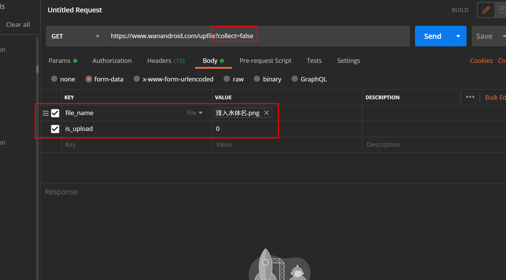

为了方便大家理解，上方将该参数，以postman的形式上传

### 多业务逻辑，如何编写测试用例

多业务这一块，我们拿个简单的例子举例，比如登录场景，在登陆之前，我们需要先获取到验证码。

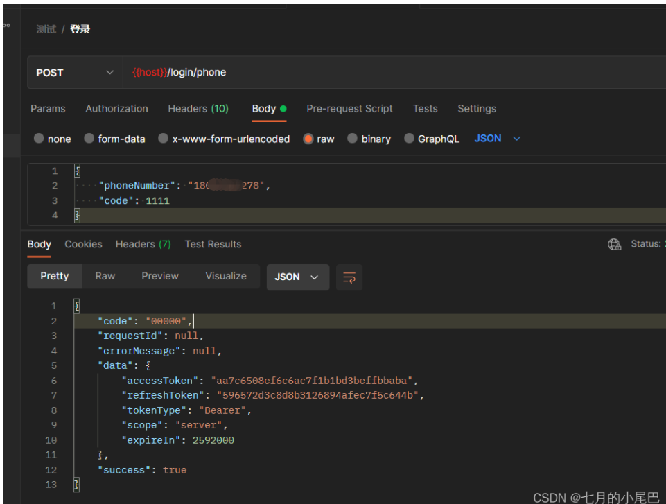

首先，我们先创建一个 get_send_sms_code.yaml 的文件，编写一条发送验证码的用例

    # 公共参数
    case_common:
      allureEpic: 盲盒APP
      allureFeature: 登录模块
      allureStory: 获取登录验证码
    
    send_sms_code_01:
        host: ${{host()}}
        url: /mobile/sendSmsCode
        method: POST
        detail: 正常获取登录验证码
        headers:
          appId: '23132'
          masterAppId: masterAppId
          Content-Type: application/json;charset=UTF-8
        # 请求的数据，是 params 还是 json、或者file
        requestType: json
        # 是否执行，空或者 true 都会执行
        is_run:
        data:
          phoneNumber: "180****9278"
          # 是否有依赖业务，为空或者false则表示没有
        dependence_case: False
            # 依赖的数据
        dependence_case_data:
        assert:
          code:
            jsonpath: $.code
            type: ==
            value: '00000'
            AssertType:
          success:
            jsonpath: $.success
            type: ==
            value: true
            AssertType:
    
        sql:

编写好之后，我们在创建一个 login.yaml 文件

    # 公共参数
    case_common:
      allureEpic: 盲盒APP
      allureFeature: 登录模块
      allureStory: 登录
    
    login_02:
        host: ${{host()}}
        url: /login/phone
        method: POST
        detail: 登录输入错误的验证码
        headers:
          appId: '23132'
          masterAppId: masterAppId
          Content-Type: application/json;charset=UTF-8
        # 请求的数据，是 params 还是 json、或者file
        requestType: json
        # 是否执行，空或者 true 都会执行
        is_run:
        data:
          phoneNumber: 18014909278
          code: $cache{login_02_v_code}
          # 是否有依赖业务，为空或者false则表示没有
        dependence_case: True
            # 依赖的数据
        dependence_case_data:
          - case_id: send_sms_code_01
            dependent_data:
              - dependent_type: response
                jsonpath: $.code
                set_cache: login_02_v_code
    
        assert:
          code:
            jsonpath: $.code
            type: ==
            value: '00000'
            AssertType:
        sql:

其中处理多业务的核心区域，主要在这里:

       dependence_case: True
            # 依赖的数据
        dependence_case_data:
          - case_id: send_sms_code_01
            dependent_data:
              - dependent_type: response
                jsonpath: $.code
                set_cache: login_02_v_code

首先，我们 dependence_case 需要设置成 True，并且在下面的 dependence_case_data 中设计相关依赖的数据。

* case_id：上方场景中，我们登录需要先获取验证码，因此依赖的case_id 就是发送短信验证码的 case_id ：send_sms_code_01
*  dependent_type：我们依赖的是获取短信验证码接口中的响应内容，因此这次填写的是 response, 同样也支持request、sql等方式
* jsonpath: 通过jsonpath 提取方式，提取到短信验证码中的验证码内容（jsonpath规格和jmeter中的json在线提取器的规则一致）
* set_cache：拿到验证码之后，这里我们可以自定义一个缓存名称 如: login_02_v_code，程序中会将你所提取到的验证码存入缓存中，
  因此我们在这条用例的 data 中，有个code 的参数，值设置成 $cache{login_02_v_code}，程序中会将我们 send_sms_code_01中的验证码给提取出来，
  通过 $cache{login_02_v_code} 语法获取到。
  
* 注意，定义缓存名称，每个公司最好定义一个规范，比如 当前这条 case_id名称 + 缓存自定义名称，如 login_02_v_code, case_id 是唯一的，
  这样可以避免不同用例之间缓存名称重复的问题，导致无法获取到对应的缓存数据

### 多业务逻辑，需要依赖同一个接口中的多个数据

    dependence_case_data:
      - case_id: send_sms_code_01
        dependent_data:
          # 提取接口响应的code码
          - dependent_type: response
            jsonpath: $.code
            set_cache: v_code
          # 提取接口响应的accessToken
          - dependent_type: response
            jsonpath: $.data.accessToken
            # 替换请求头中的accessToken
            set_cache: accessToken    

如上方示例，可以添加多个 dependent_type

### 多业务逻辑，需要依赖不同接口的数据

假设我们需要获取 send_sms_code_01、get_code_01两个接口中的数据，用例格式如下
    
    dependence_case: True
        # 依赖的数据
    dependence_case_data:
      - case_id: send_sms_code_01
        dependent_data:
          # 提取接口响应的code码
          - dependent_type: response
            jsonpath: $.code
            set_cache: v_code
      - case_id: get_code_01
        dependent_data:
          # 提取接口响应的code码
          - dependent_type: response
            jsonpath: $.code
            set_cache: v_code2

### 缓存中获取的默认是字符串

如果你已经用例写到了这一步，相信部分人在使用set_cache关键字的时候，按照下方示例，
会发现当我们使用`$cache{login_02_v_code}` 的时候，发送请求时，前端`$cache{login_02_v_code}`会默认传递一个字符串形式
这里程序中处理数据时，缓存数据默认都是字符串，如果你获取的缓存值为 int类型，则我们需要更为 `$cache{int:login_02_v_code}`
同理，如果是 list，则更改为 `$cache{list:login_02_v_code}`

    demo_01:
        host: ${{host()}}
        ...
        data:
          phoneNumber: 18014909278
          # code: $cache{login_02_v_code}
          code: $cache{login_02_v_code}
          # 是否有依赖业务，为空或者false则表示没有
        dependence_case: True
            # 依赖的数据
        dependence_case_data:
          - case_id: send_sms_code_01
            dependent_data:
              - dependent_type: response
                jsonpath: $.code
                set_cache: login_02_v_code

### 请求参数为路径参数
    
    
    collect_delete_tool_01:
        host: ${{host()}}
        url: /lg/collect/deletetool/json/$cache{collect_delete_tool_01_id}
        method: POST
        detail: 正常删除收藏网站
        headers:
          Content-Type: multipart/form-data;
          # 这里cookie的值，写的是存入缓存的名称
          cookie: $cache{login_cookie}
        # 请求的数据，是 params 还是 json、或者file、data
        requestType: None
        # 是否执行，空或者 true 都会执行
        is_run:
        data:
        dependence_case: True
        # 依赖的数据
        dependence_case_data:
          - case_id: collect_addtool_01
            dependent_data:
              - dependent_type: response
                jsonpath: $.data.id
                set_cache: collect_delete_tool_01_id

以上方实例，我们的参数是在url中的，因此我们可以通过 dependence_case 获取到我们需要依赖的数据，
将本条用例需要用到的数据存入缓存，从而在 /lg/collect/deletetool/json/$cache{collect_delete_tool_01_id} 直接调用缓存数据即可

### 将当前用例的请求值或者响应值存入缓存中

有些小伙伴之前有反馈过，比如想要做数据库的断言，但是这个字段接口没有返回，我应该怎么去做校验呢？
程序中提供了current_request_set_cache这个关键字，可以将当前这条用例的请求数据 或者响应数据 给直接存入缓存中
如下案例所示：

    current_request_set_cache:
      # 1、response 从响应中提取内容  2、request从请求中提取内容
      - type: response
        jsonpath: $.data.data.[0].id
        # 自定义的缓存名称
        name: test_query_shop_brand_list_02_id

### 请求用例时参数需要从数据库中提取

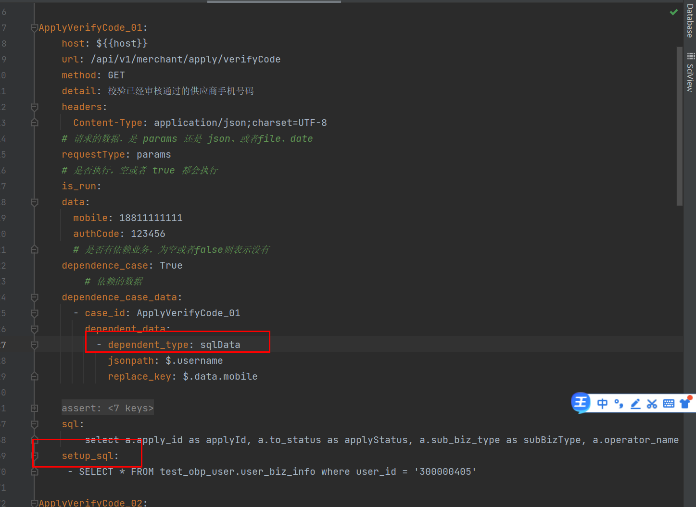

如上图所示，用例中的 dependent_type 需要填写成 sqlData。
当你的依赖类型为 sqlData 数据库的数据时，那么下方就需要再加一个 setup_sql 的参数，下方填写需要用到的sql语句

注意case_id： 因为程序设计原因，通常情况下，我们关联的业务，会发送接口请求，但是如果我们依赖的是sql的话，
是不需要发送请求的，因此我们如果是从数据库中提取数据作为参数的话，我们case_id 需要写self ，方便程序中去做区分

    ApplyVerifyCode_01:
        host: ${{host}}
        url: /api/v1/merchant/apply/verifyCode
        method: GET
        detail: 校验已经审核通过的供应商手机号码
        headers:
          Content-Type: application/json;charset=UTF-8
        # 请求的数据，是 params 还是 json、或者file、data
        requestType: params
        # 是否执行，空或者 true 都会执行
        is_run:
        data:
          mobile: 18811111111
          authCode: 123456
          # 是否有依赖业务，为空或者false则表示没有
        dependence_case: True
            # 依赖的数据
        dependence_case_data:
          - case_id: self
            dependent_data:
              - dependent_type: sqlData
                jsonpath: $.username
                replace_key: $.data.mobile
    
        assert:
          code:
            jsonpath: $.code
            type: ==
            value: 200
            AssertType:
          applyId:
            jsonpath: $.data[0].applyId
            type: ==
            value: $.applyId
            AssertType: SQL
          applyStatus:
            jsonpath: $.data[0].applyStatus
            type: ==
            value: $.applyStatus
            AssertType: SQL
    
        sql:
          - select a.apply_id as applyId, a.to_status as applyStatus, a.sub_biz_type as subBizType, a.operator_name as operatorName, a.operator_user_id as operatorUserId, b.apply_type as applyType from test_obp_midware.apply_operate_log as a inner join test_obp_midware.apply as b on a.apply_id = b.id where b.id = $json($.data[0].applyId)$ order by a.id desc limit 1;
        setup_sql:
         - SELECT * FROM test_obp_user.user_biz_info where user_id = '300000405'

### 用例中需要依赖登录的token，如何设计

首先，为了防止重复请求调用登录接口，pytest中的 conftest.py 提供了热加载机制，看上方截图中的代码，我们需要在 conftest.py 提前编写好登录的代码。

如上方代码所示，我们会先去读取login.yaml文件中的用例，然后执行获取到响应中的token，然后 编写 Cache('work_login_init').set_caches(token)，将token写入缓存中，其中 work_login_init 是缓存名称。

编写好之后，我们会在 requestControl.py 文件中，读取缓存中的token，如果该条用例需要依赖token，则直接进行内容替换。

    @pytest.fixture(scope="session", autouse=True)
    def work_login_init():
        """
        获取登录的cookie
        :return:
        """
        url = "https://www.wanandroid.com/user/login"
        data = {
            "username": 18800000001,
            "password": 123456
        }
        headers = {'Content-Type': 'application/x-www-form-urlencoded'}
        # 请求登录接口
        res = requests.post(url=url, data=data, verify=True, headers=headers).json()
        token = res['response']['token']

        CacheHandler.update_cache(cache_name='work_login_init', value=token)

这里在编写用例的时候，token 填写我们所编写的缓存名称即可。
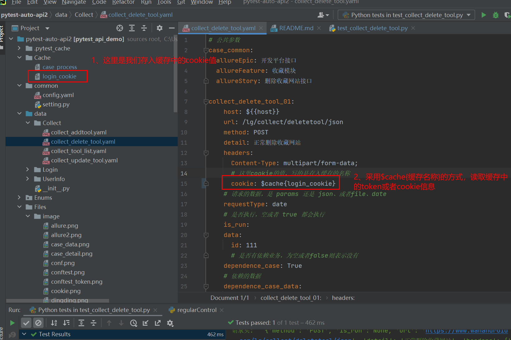

### 用例中依赖cookie如何设计

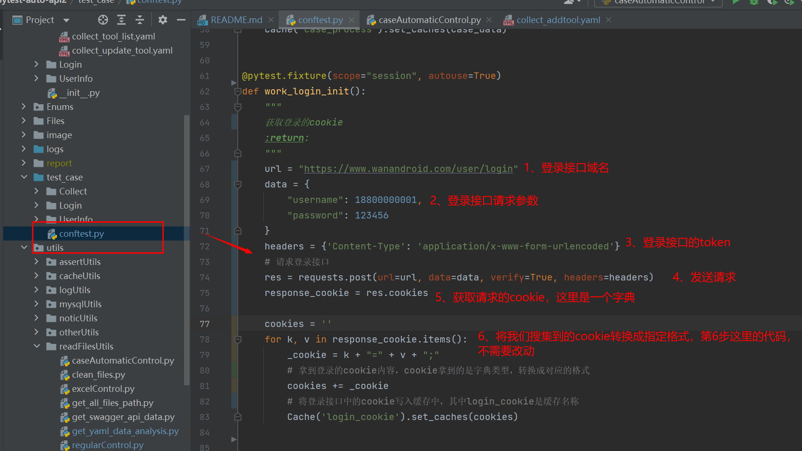

首先我们在conftest.py中编写获取cookie的方法

    @pytest.fixture(scope="session", autouse=True)
    def work_login_init():
        """
        获取登录的cookie
        :return:
        """
        url = "https://www.wanandroid.com/user/login"
        data = {
            "username": 18800000001,
            "password": 123456
        }
        headers = {'Content-Type': 'application/x-www-form-urlencoded'}
        # 请求登录接口
        res = requests.post(url=url, data=data, verify=True, headers=headers)
        response_cookie = res.cookies
    
        cookies = ''
        for k, v in response_cookie.items():
            _cookie = k + "=" + v + ";"
            # 拿到登录的cookie内容，cookie拿到的是字典类型，转换成对应的格式
            cookies += _cookie
            # 将登录接口中的cookie写入缓存中，其中login_cookie是缓存名称
            CacheHandler.update_cache(cache_name='login_cookie', value=cookies)

和token一样，我们如果用例的请求头中依赖cookie, cookie中的值，直接写我们存入缓存中的名称即可

        headers:
          Content-Type: multipart/form-data;
          # 这里cookie的值，写的是存入缓存的名称
          cookie: $cache{login_cookie}

### 用例中如何生成随机数据

比如我们有些特殊的场景，可能会涉及到一些定制化的数据，每次执行数据，需要按照指定规则随机生成。

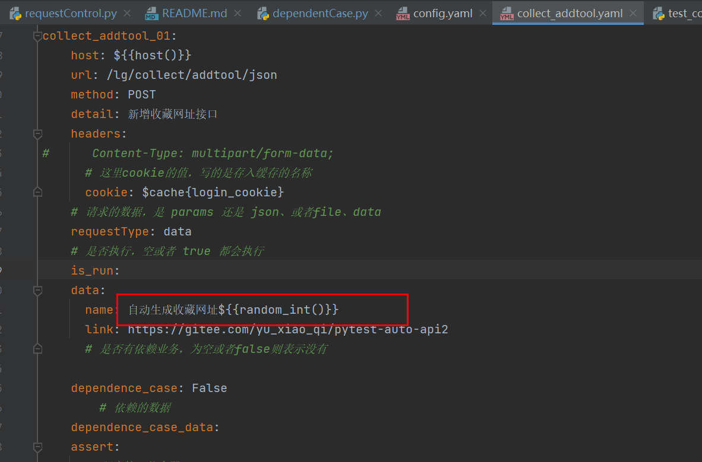

如上图所示，我们用例中的 reason 审核原因后方，需要展示审核的当前时间。那么我们首先需要封装一个获取当前时间的方法

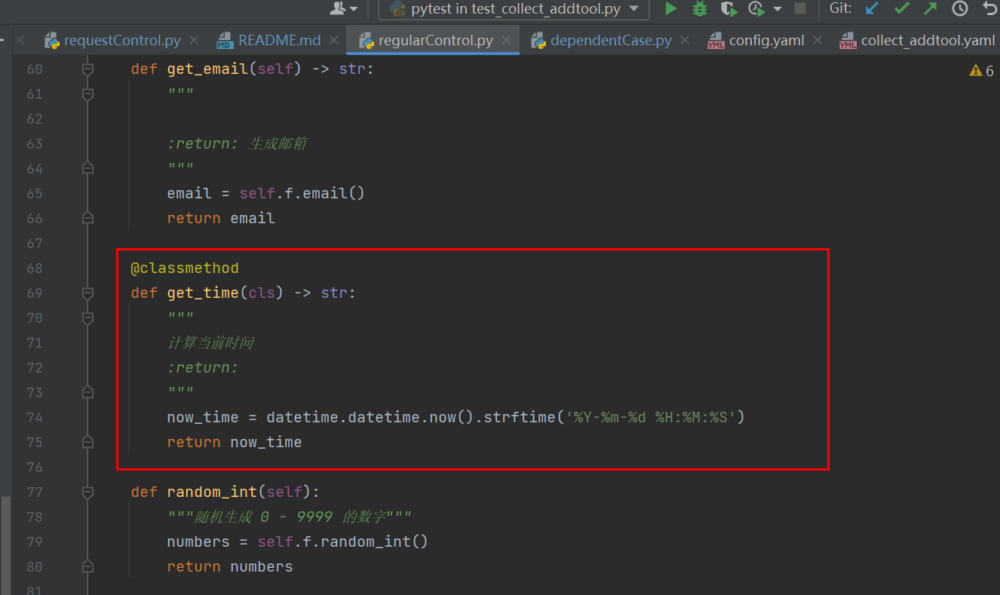

那么我们就在 regularControl.py 文件中，编写 get_time 的方法。编写好之后，在用例中编写规则如下：

    reason: 审核时间${{get_time()}}
使用 " ${{函数名称()}}" 的方法，程序调用时，会生成当前时间。在regularControl.py 文件中，我还封装了一些常用的随机数，
如随机生成男生姓名、女生姓名、身份证、邮箱、手机号码之类的，方便大家使用。
如，随机生成邮箱，我们在用例中编写的格式为 " ${{get_email()}} " 。

其他所需随机生成的数据，可在文件中自行添加。

### 自动化函数传递参数

首先同样和上方一样，创建一个随机生成的方法，改方法支持接收参数

    @classmethod
    def random_int(cls, min_num, max_num):
        """
        随机生成指定范围的随机数
        @param min_num: 最小数字
        @param max_num: 最大数字
        @return:
        """
        num = random.randint(int(min_num), int(max_num))
        return num

在用例中，假设我们需要获取一个 1-10之间的随机数，那么我们直接这样调用该数据即可

    reason: {{random_int(1， 10)}}

### 断言http响应状态码

相信有些小伙伴在做接口测试的过程中，有部分接口是没有任何响应的，那么在没有响应数据的情况下
我们就只能通过 http的状态码去判断这条用例是否通过，我们可以这样写

    assert:
      status_code: 200

我们直接在assert下方添加一个 status_code 参数，状态码我们判断其为 200

### 用例中添加等待时间

程序中可以设定接口请求之后，等待时长，假设A接口依赖B接口的业务，A接口请求完时，我们需要让他等待几秒钟
再次请求B接口，这样的话，我们可以使用sleep关键字

    sleep: 3

### 断言类型
下放截图中，是所有断言支持的类型

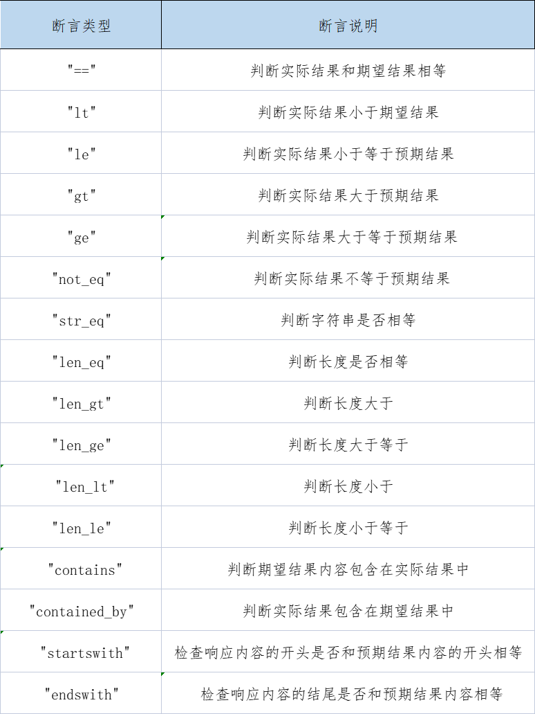

### 用例中如何进行接口断言和数据库断言

假设现在我需要测试一个报表统计的数据，该接口返回了任务的处理时长 和 处理数量。功能如下截图所示：

假设下方是我们拿到接口响应的数据内容：

    {"code": 200, "times": 155.91, "counts": 9}

这个时候，我们需要判断该接口返回的数据是否正确，就需要编写sql，对响应内容进行校验。

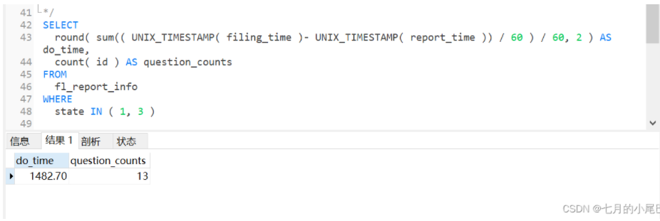

因此我们编写了如上sql，查出对应的数据，那么用例中编写规则如下，下方我们分别断言了两个内容，一个是对接口的响应code码进行断言，一个是断言数据库中的数据。

      assert:
        code:
          jsonpath: $.code
          type: ==
          value: 200
          # 断言接口响应时，可以为空
          AssertType:
       do_time:
         # jsonpath 拿到接口响应的数据
          jsonpath: $.times
          type: ==
          # sql 查出来的数据，是字典类型的，因此这里是从字段中提取查看出来的字段
          value: $.do_time
          # 断言sql的时候，AssertType 的值需要填写成 SQL
          AssertType: SQL
       question_counts:
          jsonpath: $.counts
          type: ==
          # 
          value: $.question_counts
          # 断言sql的时候，AssertType 的值需要填写成 SQL
          AssertType: SQL 
      sql:
        - select * from test_goods where shop_id = 515

我们分别对用例的数据进行讲解，首先是响应断言, 编写规则如下

    code:
      # 通过jsonpath获取接口响应中的code {"code": 200, "times": 155.91, "counts": 9}
      jsonpath: $.code
      type: ==
      value: 200
      # 断言接口响应时，可以为空
      AssertType:

下面是对sql进行断言

       question_counts:
          # 断言接口响应的问题上报数量counts {"code": 200, "times": 155.91, "counts": 9}
          jsonpath: $.counts
          type: ==
          # 查询sql，我们数据库查到的数据是一个字段，数据是这样的：{question_counts: 13, do_time: 1482.70}, 这里我们通过 jsonpath获取question_counts
          value: $.question_counts
          # 断言sql的时候，AssertType 的值需要填写成 SQL
          AssertType: SQL 
      sql:
        - SELECT round( sum(( UNIX_TIMESTAMP( filing_time )- UNIX_TIMESTAMP( report_time )) / 60 ) / 60, 2 ) AS do_time, count( id ) AS question_counts FROM fl_report_info WHERE state IN ( 1, 3 )

有些细心的小伙伴会发现，我们的sql，是列表类型的。这样就意味这，我们的sql可以同时编写多条，这样会对不会编写多表联查的小伙伴比较友好，可以进行单表查询，获取我们需要的数据。

    sql:
      - select * from users;
      - select * from goods;

### 使用teardown功能，做数据清洗

通常情况下，我们做自动化所有新增的数据，我们测试完成之后，都需要讲这些数据删除，程序中支持两种写法
一种是直接调用接口进行数据删除。另外一种是直接删除数据库中的数据，建议使用第一种，直接调用业务接口删除对应的数据

1、下面我们先来看看第一种删除方式，teardown的功能，因为需要兼容较多的场景，因此使用功能上相对也会比较复杂
需要小伙伴们一个一个去慢慢的理解。

下面为了方便大家对于teardown功能的理解，我会针对不同的场景进行举例：

* 假设现在我们有一个新增接口，写完之后，我们需要先调用查询接口获取到新增接口的ID，然后再进行删除
那么此时会设计到两个场景，首先执行新增接口ID，然后再拿到响应（这里有个逻辑上的先后关系，查询接口，是先发送请求，在提取数据）
  获取到查询的ID之后，我们在执行删除，删除的话，我们是直接发送请求
  
那么针对这个场景，我们就需要有个关键字去做区分，什么场景下先发送请求，什么场景下后发送请求，下面我们来看一下案例，方便大家理解

    teardown:
      # 查看品牌审核列表，获取品牌的apply_id
      - case_id: query_apply_list_01
        # 注意这里我们是先发送请求，在拿到自己响应的内容，因此我们这个字段需要写param_prepare
        param_prepare:
            # 因为是获取自己的响应内容，我们dependent_type需要写成 self_response
          - dependent_type: self_response
            # 通过jsonpath的方法，获取query_apply_list_01这个接口的响应内容
            jsonpath: $.data.data.[0].applyId
            # 将内容存入缓存，这个是自定义的缓存名称
            set_cache: test_brand_apply_initiate_apply_01_applyId
            
            # 支持同时存多个数据，只会发送一次请求
          - dependent_type: self_response
            jsonpath: $.data.data.[0].brandName
            set_cache: test_brand_apply_initiate_apply_01_brandName
        
      # 删除
      - case_id: delete_01
        # 删除的话，我们是直接发送请求的，因此我们这里写 send_request
        send_request:
            # 我们上方已经拿到了ID，并且将ID存入缓存中，因此这里依赖数据的类型为cache，直接从缓存中提取
          - dependent_type: cache
            # 这个是缓存名称
            cache_data: test_brand_apply_initiate_apply_01_applyId
            # 通过relace_key 去替换 delete_01 中的 applyID参数
            replace_key: $.data.applyId

* 那么有些小伙伴会在想，同样我们以上方的接口场景为例，有些小伙伴会说，我公司的新增的接口，有直接返回ID，不需要调用查询接口
程序中当然也支持这种场景，我们只需要这么编写

      - case_id: process_apply_01
        # 同样这么写 send_request
        send_request:
            # 这里我们从响应中获取
          - dependent_type: response
            # 通过jsonpath的方式，获取响应的内容
            jsonpath: $.data.id
            # 使用repalce_key进行替换
            replace_key: $.data.applyId  

* 程序中也支持从请求里面获取内容，编写规则如下

      - case_id: process_apply_01
        # 同样这么写 send_request
        send_request:
            # 这里我们从响应中获取
          - dependent_type: request
            # 通过jsonpath的方式，获取请求的内容
            jsonpath: $.data.id
            # 使用repalce_key进行替换
            replace_key: $.data.applyId

### 使用 teardown_sql 后置sql删除数据
如一些特殊场景，业务上并没有提供删除接口，我们也可以直接通过 sql去讲对应的sql删除
    teardown_sql:
        - delete * from xxx
        - delete * from xxx
    
### 自动生成test_case层代码

小伙伴们在编写好 yaml 用例之后，可以直接执行 caseAutomaticControl.py ，会跟你设计的测试用例，生成对应的代码。

### 发送钉钉通知通知

### 发送企业微信通知

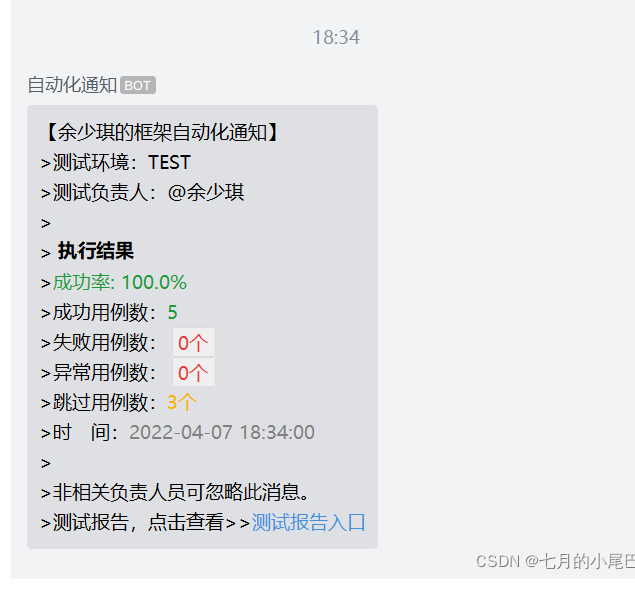

### 日志打印装饰器

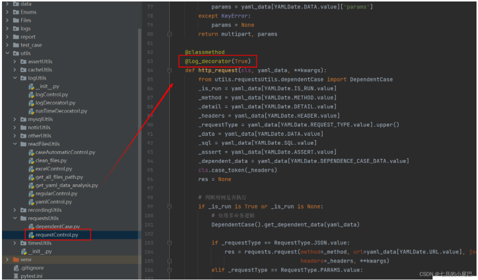

在requestControl.py中，我单独封装了一个日志装饰器，需要的小伙伴可以不用改动代码，直接使用，如果不需要，直接注释，或者改成False。控制台将不会有日志输出

### 统计用例运行时长

同样，这里封装了一个统计用例运行时长的装饰器，使用改装饰器前，需要先进行导包

    from utils.logUtils.runTimeDecoratorl import execution_duration
导入之后，调用改装饰器，装饰器中填写的用例执行时长，以毫秒为单位，如这里设置的2000ms，那么如果该用例执行大于2000ms，则会输出一条告警日志。

    @execution_duration(2000)

### 生成allure报告

我们直接运行主程序 run.py ，运行完成之后，就可以生成漂亮的allure报告啦~

### 其他

本框架为2.0升级版本，升级之后的功能，现在基本上都是在yaml中维护用例，无需测试人员编写代码，
和 1.0版本的区别在于，1.0版本还需要测试人员手动编写多业务逻辑的代码，需要有一定基础编码的能力

但是1.0版本，同样也可以自动生成代码，yaml中维护数据，对相对简单，如果偏于yaml简单维护的同学，可以切换查看1.0分支
下方是1.0分支的操作文档：[点我查看](https://blog.csdn.net/weixin_43865008/article/details/121903028?spm=1001.2014.3001.5502)

*******************************************************

以上便是整个框架的使用说明，这个框架属于个人业余时间开发，大家如果在使用中遇到什么问题，或者有相关建议，可以随时反馈给我，
_框架内容会随着大家的反馈，持续更新！邮箱地址：1602343211@qq.com

如果觉得框架有帮助到你，麻烦收藏一下哦~~谢谢。:)

## 版本更新记录
* V2.0.0(2022-04-07)
  [重构] 新增多业务逻辑依赖处理，统一改成yaml文件中维护用例，无需编写代码，基于V1.0版本进行重构
* [查看更多记录点此查看](https://gitee.com/yu_xiao_qi/pytest-auto-api2/wikis/Home)

## 赞赏

如果这个库有帮助到你并且你很想支持库的后续开发和维护，那么你可以扫描下方二维码随意打赏我，我将不胜感激

  

