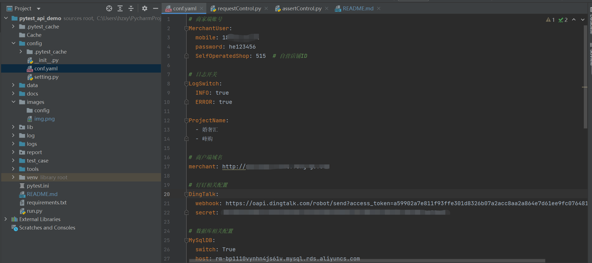
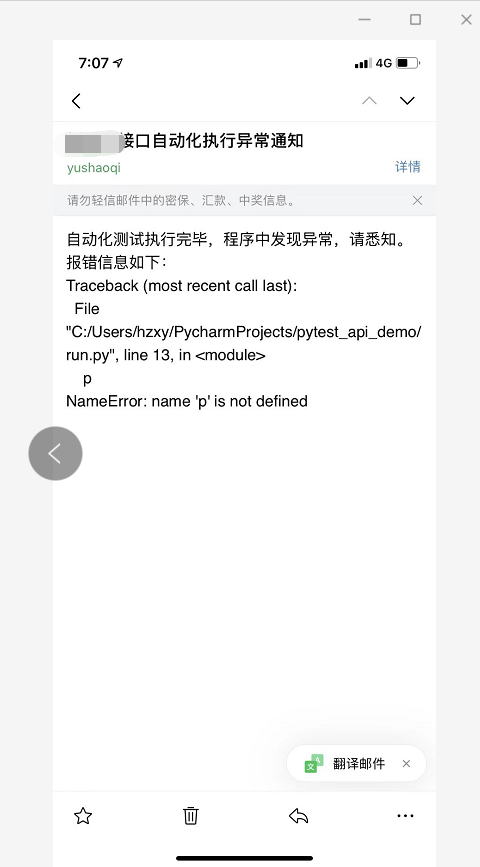
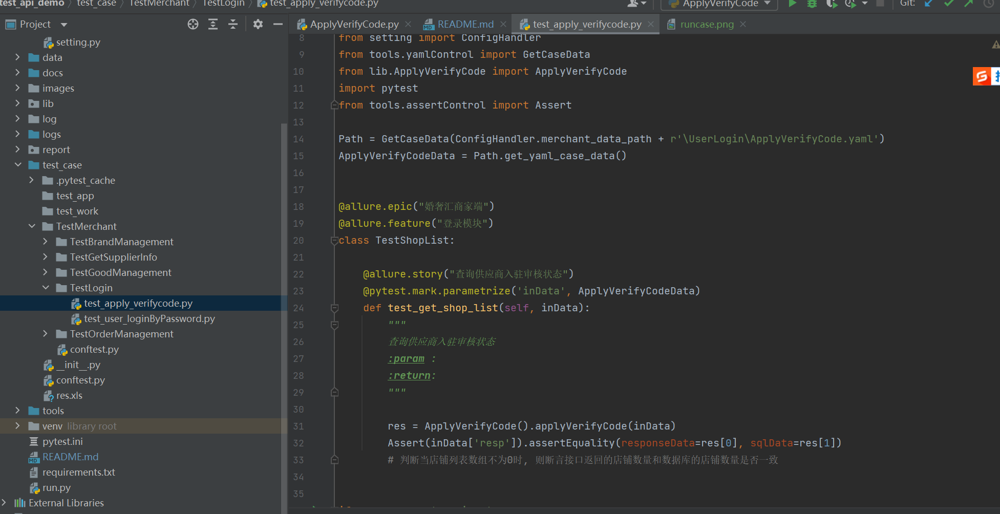

## 框架介绍

本框架主要是基于 Python + pytest + allure + log + yaml + mysql + 钉钉通知 + Jenkins 实现的接口自动化框架。

* git地址: [https://gitee.com/yu_xiao_qi/pytest-auto-api](https://gitee.com/yu_xiao_qi/pytest-auto-api)
* 项目参与者: 余少琪
* 技术支持邮箱: 1603453211@qq.com
* 个人博客地址:  [https://blog.csdn.net/weixin_43865008](https://blog.csdn.net/weixin_43865008)

如果对您有帮助，请点亮 小星星 以表支持，谢谢


## 框架优势

本框架不收取任何费用， 其优势在于测试人员直接编写测试用例，运行框架可自动生成测试代码。
框架支持多环境、多角色任意切换，支持接口响应断言以及数据库断言。

## 实现功能

* 测试数据隔离, 实现数据驱动
* 支持多接口数据依赖: 如A接口需要同时依赖B、C接口的响应数据作为参数
* 数据库断言: 直接在测试用例中写入查询的sql即可断言，无需编写代码
* 动态多断言: 如接口需要同事校验响应数据和sql校验，支持多场景断言
* 自动生成用例代码: 测试人员在yaml文件中填写好测试用例, 程序可以直接生成用例代码，纯小白也能使用
* 统计接口的运行时长: 拓展功能，订制开关，可以决定是否需要使用
* 日志模块: 打印每个接口的日志信息，同样订制了开关，可以决定是否需要打印日志
* 钉钉、企业微信通知: 支持多种通知场景，执行成功之后，可选择发送钉钉、或者企业微信、邮箱通知
* 自定义拓展字段: 如用例中需要生成的随机数据，可直接调用
* 多线程执行

## 目录结构
    ├── Cache                       // 存放缓存文件
    ├── config                      // 配置
    │   ├── conf.yaml               // 公共配置
    │   ├── setting.py              // 环境路径存放区域
    ├── data                        // 测试用例数据
    ├── docs                        // 文档
    ├── lib                         // 对象层，用作于接口的调用
    ├── log                         // 日志层
    ├── report                      // 测试报告层
    ├── test_case                   // 测试用例代码
    ├── tool                        // 所有公共模块的封装 
    │   └── assertControl.py        // 断言模块
    │   └── cacheControl.py         // 缓存模块
    │   └── dingtalkControl.py      // 钉钉发送通知
    │   └── excelControl.py         // 读取excel文件
    │   └── gettimeControl.py       // 时间模块
    │   └── logControl.py           // 日志模块
    │   └── logDecorator.py         // 日志装饰器
    │   └── mysqlControl.py         // 数据库模块
    │   └── regularControl.py       // 正则模块
    │   └── requestControl.py       // 请求模块
    │   └── runtimeControl.py       // 响应时长统计模块
    │   └── sendmailControl.py      // 发送邮件
    │   └── testcaseAutomaticControl.py      // 自动生成测试代码
    │   └── yamlControl.py          // yaml文件
    ├── Readme.md                   // help
    ├── pytest.ini                  
    ├── run.py                      // 运行入口  
    

## 依赖库

    allure-pytest==2.9.45
    allure-python-commons==2.9.45
    atomicwrites==1.4.0
    attrs==21.2.0
    certifi==2021.10.8
    cffi==1.15.0
    charset-normalizer==2.0.7
    colorama==0.4.4
    colorlog==6.6.0
    cryptography==36.0.0
    DingtalkChatbot==1.5.3
    execnet==1.9.0
    Faker==9.8.3
    idna==3.3
    iniconfig==1.1.1
    jsonpath==0.82
    packaging==21.3
    pluggy==1.0.0
    py==1.11.0
    pycparser==2.21
    PyMySQL==1.0.2
    pyOpenSSL==21.0.0
    pyparsing==3.0.6
    pytest==6.2.5
    pytest-forked==1.3.0
    pytest-xdist==2.4.0
    python-dateutil==2.8.2
    PyYAML==6.0
    requests==2.26.0
    six==1.16.0
    text-unidecode==1.3
    toml==0.10.2
    urllib3==1.26.7
    xlrd==2.0.1
    xlutils==2.0.0
    xlwt==1.3.0

#### 安装Python、Pip环境，创建虚拟环境  
```
一、安装Python环境

# 1、下载Python程序
# Python包地址：https://www.python.org/ftp/python/
wget https://www.python.org/ftp/python/3.8.5/Python-3.8.5.tgz

# 2、解压Python-3.8.5.tgz
tar -zxvf Python-3.8.5.tgz

# 3、编译安装
sudo mkdir /usr/local/python3.8.5
cd Python-3.8.5
sudo ./configure --prefix=/usr/local/python3.8.5
sudo make && sudo make install

# 4、建立软链接
sudo ln -s /usr/local/python3.8.5/bin/python3 /usr/bin/python3
sudo ln -s /usr/local/python3.8.5/bin/pip3 /usr/bin/pip3

# 5、验证安装
python3 -V
pip3 -V

二、安装虚拟环境、创建虚拟环境
# 1、安装虚拟环境virtualenv
yum install -y python-virtualenv

# 2、创建虚拟环境
# 在项目根目录创建虚拟环境
virtualenv -p python3 venv

# 3、激活虚拟环境
source ./venv/bin/activate

# 4、退出虚拟环境
deactivate
```

## 安装教程

输入如下命令，安装本框架的所有第三方库依赖

    pip install -r requirements.txt

## 使用说明

### config-->conf.yaml



首先是配置文件，这里主要存放了一个公共的配置数据，如项目名称、钉钉、邮箱、企业微信、数据库等相关的配置全部都在这里
所有的字段，在conf.yaml中，都有相关的注释，自行修改即可。

目前框架主要是用的企业微信通知，在用例执行成功之后发送通知，通知内容如下，可以根据公司主要使用的通讯工具自行更改。
在公共方法中分别封装了钉钉通知、以及邮箱通知。


如程序执行执行异常时，会自动收集错误信息，并将内容发送邮件。



### config --> setting.py

setting.py 文件主要是用来存放项目中所有文件的目录地址

更改过一些公用的配置之后，下面我们来开始编写自动化

### data 用来存放测试用例


上方主要是测试用例，测试用例是整个自动化程序中非常重要的一部分，需要严格按照我上方图中的格式进行编写。
下面我会对每个字段依次进行解释对应的作用。

- url: 请求接口的地址，${{MerchantHost}} 为接口的host，放在conf.yaml 文件中，可以更改成公司项目的host
- method: 请求方式，目前支持GET、POST、DELETE、PUT，本人公司目前设计到的请求方式只有这四种，如有需求可自行添加
- detail: 用例描述，程序中未强制要求必填，但是最好是每个用例都填写上，打印日志以及生成代码的函数注释，都会依赖用例描述
- header: 请求头
- data: 请求参数
    - requestType: 必填，这个字段主要取决于你请求的是参数是以json、params、file、或者data的格式
    - 如接口中需要的请求参数全部放在data中
- resp: 响应断言相关的数据
    - 响应接口的参数字段(如code): code，就是接口的响应状态码，这些参数都是自己加的。
      - jsonpath: 这里获取到对应的接口数据，主要使用到了jsonpath。如果有不了这一块的，大家可以看我的博客：https://blog.csdn.net/weixin_43865008/article/details/118371620
      - value: 预期值，这里会根据你前面jsonpath中获取到的响应数据，然后和你添加的预期值进行断言。如果断言失败，会打印对应的日志信息，以及allure测试报告中也会呈现这条用例的失败状态
      - type: 断言的类型，如判断是否相等，则使用”==“，或者”!=“，则表示内容不相等，”IN“则表示预期值是否在响应值中，对应的还有"NOTIN"
      - AssertType: 目前自动化支持两种断言类型，接口响应断言和数据库断言。如果是接口响应断言，则AssertType的值可不填，如果值为"SQL"的话，则走数据库断言。为sql的时候，sql查询出来的数据类型是字典类型，因此value值会从sql查询出来的字段中使用jsonpath的形式读取sql查询出来的数据
    - 如有多个数据，则可像上方图中一样，创建多个字段
    - sql: sql 是以 LIST 的类型存储的，可以将我们这个接口需要依赖的sql语句全部放在这里，程序中会循环查询出sql中的所有语句，并且返回数据库中的值，从而与接口响应的值做匹配。（这里也是对于sql多表联查不太会的朋友的福音。如果不会多表联查的话，可以编写单表sql，程序中会将所有单表的数据内容全部查询出来）
- 接口中如有多条测试用例，则以上方格式为例，添加多个即可。

## lib---> xxx.py

假设我们按照上方图中的格式内容，创建了一个用例创建成功之后yaml文件的用例，创建之后下面我们来生成自动化脚本，执行第一条用例。


首先，我们找到tools目录下的 testcaseAutomaticControl.py 文件，然后执行这里的代码

执行成功之后，我们可以看到lib目录下，会生成一个和创建用例yaml文件名称一模一样的py文件。
内容如下：

    
下面我们就可以开始执行我们的测试用例了，这里生成的文件，主要类似于我们自动化模型中的PO模型，生成的page

执行之后，我们可以看到下方详细的请求日志信息，方便我们进行用例调试


test_case --> test_apply_verifycode.py

用例调试成功之后，下面我们进入编写用例脚本阶段，主要内容如下：



其中代码中关于pytest的相关内容，网上的资料有非常多，并且非常详情，这里不做赘述。

所有的用例内容，格式都为统一的，唯一需要自己修改的就是类、函数名称，以及测试用例的路径。
因为测试用例层，不同的公司业务多种多样，并且很多业务逻辑较为复杂，因此这里没有采用自动生成脚本的形式，还需测试人员自己编写。

用例添加完成之后，执行run.py，程序会执行所有文件的用例，并且生成测试报告，发送钉钉通知。


*******************************************************

以上便是整个框架的使用说明，这个框架属于个人业余时间开发，大家如果在使用中遇到什么问题，或者有相关建议，可以随时反馈给我，
框架内容会随着大家的反馈，持续更新！邮箱地址：1602343211@qq.com

如果觉得框架有帮助到你，麻烦收藏一下哦~~谢谢。:)